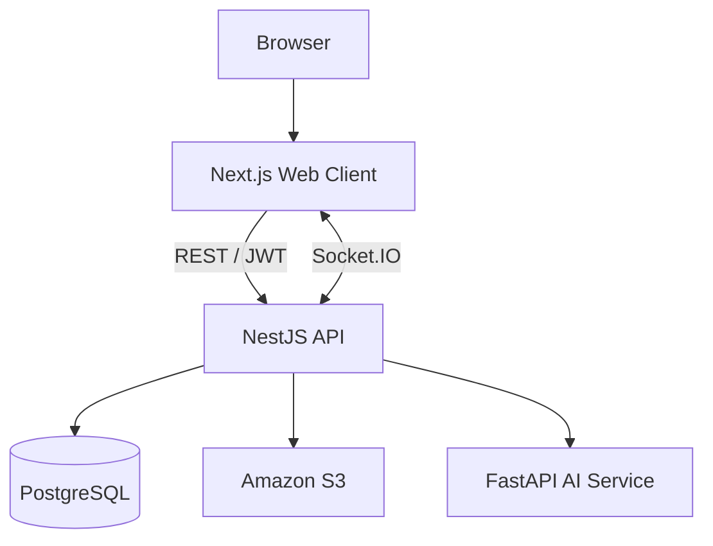

# Let Eat Go

> 食事をきっかけに、新しい人と新しい日常をつなぐソーシャルダイニングプラットフォーム

  
  
  
  
  

## About

Let Eat Goは、共通の関心を持つ人々が食事を通じて交流できるWebアプリケーションです。

ユーザーは地域・日程・参加条件からソーシャルダイニングを探し、自分でイベントを開催したり、既存のイベントに参加したりできます。リアルタイムチャット、マップ、レビュー、アルバム、プロフィール、AIテキスト分類を一つのサービスに統合しました。

本プロジェクトは、ヨンジン専門大学の4名で開発したチームプロジェクトです。フロントエンド、バックエンド、AIサービスを独立したリポジトリとして構成し、GitHub Issues、Pull Requests、Docker、GitHub Actionsを利用して開発しました。

> **Current status:** 公開デモ環境、ローカル開発手順、テスト・CIをポートフォリオ品質へ再整備しています。

## Repositories

| Service | Responsibility | Repository |
| --- | --- | --- |
| Web Client | UI, OAuth flow, Kakao Maps, real-time chat, internationalization | [project-leteatgo-nextjs-repo](https://github.com/YJU-5/project-leteatgo-nextjs-repo) |
| Backend API | REST API, JWT, WebSocket, PostgreSQL, S3 integration | [project-leteatgo-nestjs-repo](https://github.com/YJU-5/project-leteatgo-nestjs-repo) |
| AI Service | DistilBERT text classification and model serving | [ai-service](https://github.com/YJU-5/ai-service) |

## Architecture

## Key Features

- ソーシャルダイニングの検索・開催・参加
- Kakao Mapsを利用したイベント探索
- Google・Kakaoソーシャルログイン
- Socket.IOによるリアルタイムチャット
- アルバム、コメント、いいね、レビュー
- 韓国語・日本語UI
- DistilBERTによる不適切表現の分類
- DockerとGitHub Actionsを利用したAWSデプロイ

## Team

- [chatmdgus](https://github.com/chatmdgus)
- [jinmo550](https://github.com/jinmo550)
- [KimHyeongSun445](https://github.com/KimHyeongSun445)
- [lemonwasp](https://github.com/lemonwasp)

## Project Scope

This organization contains an educational team project. The repositories are being maintained as a technical portfolio and learning resource. No open-source license has been declared unless a repository states otherwise.
